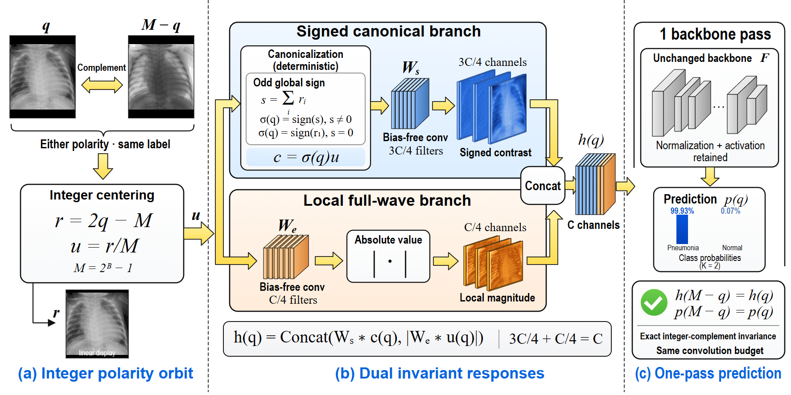

# DPOS: Dual Polarity-Orbit Stem

[Repository](https://github.com/liguojie09/ICASSP27_DPOS)


The figure is reproduced from the manuscript. Its image, feature maps, and
probabilities use the illustrated PneumoniaMNIST example described there.

## Files

```text
ICASSP27_DPOS/
├── dpos.py             # DPOS stem and optional convolution conversion
├── requirements.txt    # PyTorch dependency
├── README.md
└── assets/
    └── method.png      # Manuscript method figure
```

The package contains the method only: no checkpoints, dataset archives, training
scripts, or evaluation scripts.

## Installation

Use Python 3.10 or newer with PyTorch installed. Alternatively:

```bash
pip install -r requirements.txt
```

Copy `dpos.py` into your project or import it from this directory.
The implementation was checked with Python 3.13.3 and PyTorch 2.8.0 on a central processing unit (CPU),
including bfloat16 automatic mixed precision.

## Usage

### A new grayscale stem

```python
from dpos import DPOSStem

stem = DPOSStem(out_channels=32, kernel_size=7, stride=2, padding=3)
features = stem(x)  # x: [N, 1, H, W], native 8-bit pixels / 255.0
```

The default stem has 24 signed filters and 8 magnitude filters. For input size
224 x 224, it returns features of shape `[N, 32, 112, 112]`. Keep the backbone's
normalization, activation, and subsequent layers after this stem.

### An existing input convolution

```python
from dpos import DPOSStem

# model is an existing ResNet-18; its conv1 may have grayscale or red-green-blue (RGB) inputs.
model.conv1 = DPOSStem.from_conv2d(model.conv1)
```

`from_conv2d` accepts a bias-free, ungrouped input convolution with one or three
input channels and an output width divisible by four. It preserves convolution
geometry, device, and weight dtype. RGB weights are summed into grayscale
filters. For ResNet-18, the first 48 filters initialize the signed branch and the
remaining 16 initialize the magnitude branch. Their output order is retained;
the existing normalization layer and the rest of the backbone stay in place.
The function does not download or load weights.

### Input convention

- Supply floating-point grayscale tensors of shape `[N, 1, H, W]` in `[0, 1]`,
  obtained from native 8-bit pixels divided by 255.
- Feed these values directly to DPOS; apply any backbone feature normalization
  after the stem rather than mean/std normalization before it.
- Keep the stem on the same device as its inputs. Float32 parameters can be used
  with PyTorch automatic mixed precision; integer centering and the sign
  reduction remain in float32.

## Method

For an image of height H and width W, native 8-bit pixels are centered as

```math
q\in\{0,\ldots,255\}^{H\times W},\qquad r=2q-255,\qquad u=r/255.
```

The global sign uses the centered sum, with the first pixel in raster order as
the deterministic tie-breaker:

```math
s=\sum_i r_i,\qquad
\sigma(q)=
\begin{cases}
\mathrm{sign}(s), & s\ne 0,\\
\mathrm{sign}(r_1), & s=0.
\end{cases}
```

The canonical representative is

```math
c(q)=\sigma(q)u(q),\qquad c(255-q)=c(q).
```

Every centered native 8-bit pixel is nonzero. The centered sum and the tie-breaker
both reverse sign under complement, which gives the identity above. The stem
then concatenates signed canonical responses and full-wave magnitudes:

```math
h(q)=\mathrm{Concat}\left(W_s\ast c(q),\;\left|W_e\ast u(q)\right|\right),
\qquad C_s=3C/4,\quad C_e=C/4.
```

Here, the star denotes convolution. Both filter banks are bias-free. Their total
convolution weight count and multiply-accumulate count equal those of a
one-channel convolution with the same output width and geometry. Centering,
sign selection, and absolute value add elementwise work.

The integer-complement identity holds in exact arithmetic. Equal predictions
also require deterministic downstream evaluation. At the paper's 224 x 224
resolution, the centered integer sum is exactly representable in float32.

The code implements the 3:1 allocation used by DPOS24: 24 signed and 8 magnitude
filters for the compact model, or 48 and 16 for ResNet-18.

## Results from the manuscript

These are the paper's trained-model results and timing measurements. They are
not new experiments with this method-only package.

### Compact-model comparison

The table below is an excerpt of the expanded 13-method comparison in Table 1.
It includes empirical risk minimization (ERM), ERM with two-view test-time
augmentation (TTA), and DPOS24. The paper also reports ten published-method
adaptations under the same compact-model protocol.

Area under the receiver operating characteristic curve (AUROC) and balanced
accuracy (BAcc) are both higher-is-better. Worst-polarity performance is the
minimum of the clean and complemented scores **within each run**, followed by
aggregation. Values are mean ± sample standard deviation (SD), with three
independent training runs for PneumoniaMNIST and OrganAMNIST and five for
BreastMNIST. TTA reuses each trained ERM model. Bold marks the highest mean among
all 13 methods in the paper for that dataset and metric.

| Dataset | Method | Worst-polarity AUROC ↑ | Worst-polarity BAcc ↑ |
| --- | --- | ---: | ---: |
| PneumoniaMNIST | ERM | 0.9052 ± 0.0120 | 0.7625 ± 0.0607 |
| PneumoniaMNIST | ERM+TTA | 0.9491 ± 0.0026 | 0.8033 ± 0.0530 |
| PneumoniaMNIST | DPOS24 | **0.9553 ± 0.0142** | **0.8761 ± 0.0458** |
| OrganAMNIST | ERM | 0.7762 ± 0.0215 | 0.3373 ± 0.0215 |
| OrganAMNIST | ERM+TTA | 0.9670 ± 0.0033 | 0.6930 ± 0.0132 |
| OrganAMNIST | DPOS24 | **0.9808 ± 0.0022** | **0.7593 ± 0.0071** |
| BreastMNIST | ERM | 0.7361 ± 0.0438 | 0.5129 ± 0.0314 |
| BreastMNIST | ERM+TTA | 0.8780 ± 0.0220 | 0.5525 ± 0.0868 |
| BreastMNIST | DPOS24 | **0.8829 ± 0.0094** | **0.7974 ± 0.0345** |

### ResNet-18 forward latency

Batch size 32, float32, NVIDIA A800; lower is better. After 10 warm-ups, the paper
reports the median of five groups of 20 synchronized timed evaluations.

| Method | Backbone passes | PneumoniaMNIST (ms) ↓ | OrganAMNIST (ms) ↓ | BreastMNIST (ms) ↓ |
| --- | ---: | ---: | ---: | ---: |
| ERM | 1 | **6.985** | **7.087** | **7.001** |
| ERM+TTA | 2 | 14.000 | 14.186 | 14.047 |
| DPOS24 | 1 | 7.540 | 7.662 | 7.598 |

DPOS24 uses approximately 54% of the measured two-view forward latency.

### Clean/complement prediction consistency

The discrepancy is the maximum absolute probability difference over all
official test cases and classes for each ResNet-18 model (n = 1). Lower is better.
"Best of 10 SOTA adapters" reports the smallest discrepancy among the ten
published state-of-the-art (SOTA) adaptations separately for each dataset.

| Method | PneumoniaMNIST ↓ | OrganAMNIST ↓ | BreastMNIST ↓ |
| --- | ---: | ---: | ---: |
| ERM | 0.9698 | 1.0000 | 0.9998 |
| Best of 10 SOTA adapters | 0.9326 (SoftAug) | 0.9987 (PixMix) | 0.9807 (PRIME) |
| ERM+TTA | **0.0000** | **0.0000** | **0.0000** |
| DPOS24 | **0.0000** | **0.0000** | **0.0000** |

ERM+TTA has zero discrepancy because it averages the same two probability
vectors in either input order. DPOS24 reaches zero through its invariant stem,
using one backbone evaluation. The paper's supplementary table contains the
complete per-adapter discrepancies.
